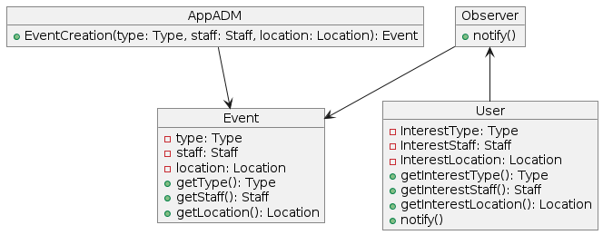
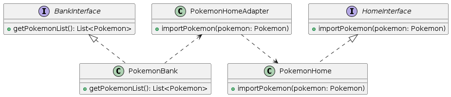
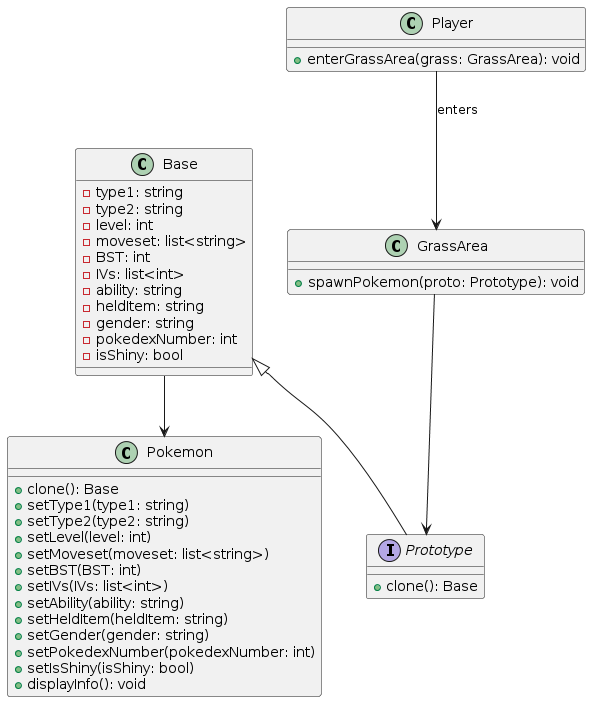

<h1 align="left">Trabalho Padrões de Projeto</h1>

###

O seguinte repositório é destinado a realização da atividade de Padrões de Projeto da disciplina Engenharia de Software (BCC304)

###

<h2 align="left">I Padrões escolhidos</h2>

###

1 - Observer 2 - Adapter 3 -  Prototype  Como indicado pelo professor, os padrões foram retirados do site https://refactoring.guru/pt-br  Cada padrão apresentara um exemplo e um diagrama UML

###

<h2 align="left">I Observer</h2>

###

 Problema:  
Frequentemente um código pode precisar notificar múltiplos objetos sobre alterações de estado de um ou múltiplos objetos. Esse fluxo de notificações pode criar conflitos e tornar o código menos compreensível. 
 
Solução: 
O padrão Observer visa criar uma solução prática e eficiente, atribuindo uma "lista de inscrição" para os objetos observadores, dessa forma, eles serão notificados apenas quando ocorrerem as alterações de estado em que estão inscritos. 
 
Exemplo: 
Em um aplicativo hipotético, criado para notificar seus usuários sobre eventos relacionados à franquia Pokémon um Observer poderia ser implementado para possibilitar o utilizador a se inscrever em tópicos objetivos, como jogos específicos, mídias que se interessa e região onde vive, para ser notificado apenas dos eventos pertinentes. 
 
No diagrama há uma classe "AppADM" que pode criar objetos "Eventos", em suas atribuições, todo evento possúi uma mídia (Jogos ou TCG), uma organização (Oficial ou Comunidade), uma localização (JP, EU, NA ou Latam). A classe "observer" deve pegar essas atribuições dos objetos Evento e notificar objetos usuários que possuam correspondências com essas atribuições.
 

###

<h2 align="left">I Adapter</h2>

###

Problema: 
Na elaboração de códigos ou sistemas mais complexos, por exemplo, um código utilizando uma base de dados de terceiro, podem ocorrer situações onde interfaces não consigam comunicar entre si, criando incompatibilidade entre partes do sistema.  
 
Solução: 
O Adapter visa agir como um "tradutor", um objeto especial no código que recebe informações de uma parte e as adapta para que possam ser processadas pela outra. Sendo um objeto com essa função exclusiva, torna-se mais fácil modificar a "tradução" caso venha a ser necessário. 
 
Exemplo: 
Ao realizar a transição entre consoles, do 3DS para o Switch, a Pokémon Company, em parceria com a ILCA, desenvolveram um novo sistema de armazenamento digital de Pokémon, o Pokémon Home, substituindo o antigo Bank. Nesse processo, os usuários precisaram realizar a migração de seus monstrinhos entre os diferentes sistemas. 
 
Nesse contexto, considerando que cada sistema foi desenvolvido por empresas diferentes, para dispositivos diferentes e com perspectivas distintas, considerando que o Home visa ser mais abrangente, tendo suporte para o Pokémon Go, uma interface Adapter poderia ser utilizada para auxiliar na migração de dados entre os diferentes sistemas. 
 

###

<h2 align="left">I Prototype</h2>

###

Problema: 
Em sistemas complexos, ao lidar com a criação de mútliplos objetos que compartilham de uma mesma estrutura básica, pode ser difícil criar novas instâncias sem causar redundâncias no código ou criar classes adicionais para cada variação. 
 
Solução: 
O implementação de uma intrface Prototype visa resolver esse problema permitindo a criação de novos objetos por meio de um objeto pré-estabelecido, chamado protótipo. Em vez de criar uma nova instância do zero e definir todos os atributos novamente, o padrão Prototype clona o protótipo e permite fazer ajustes específicos, quando necessário, no objeto clonado. 
 
Exemplo: 
Exemplo:
Na criação de um fangame de Pokémon, podemos utilizar o Prototype para gerar monstrinhos selvagens de forma eficiente partindo de um protótipo pré estabelecido com as variáveis necessárias (tipo1, tipo2, level, moveset, BST, IVs, Hability, Helditem, Gender, Pokedexnumber, BoolShiny). 
 
Dessa forma, pré estabelecendo condições específicas, é possível que, ao entrar em uma grama específica no jogo, sejam gerados Pokémon selecionados com variáveis pré definidas, de forma aleatória. 

###

###
